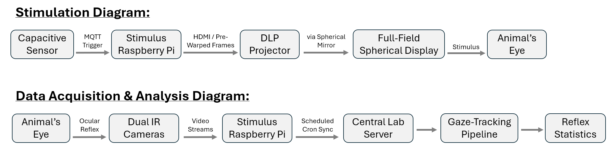
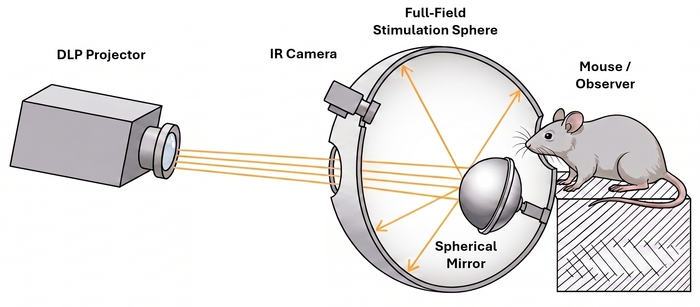
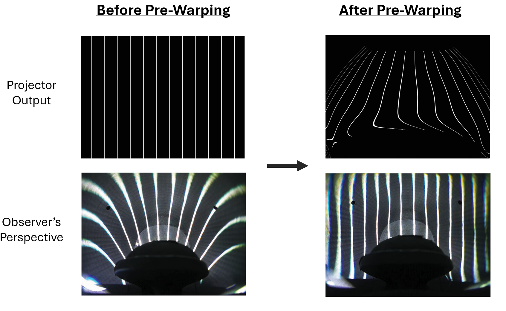
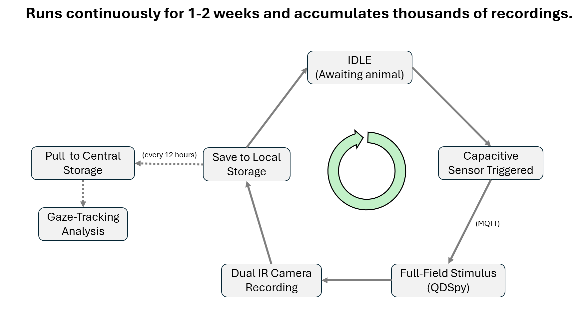
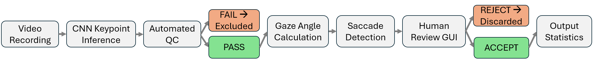

# Full-Field Spherical Stimulator & Ocular Reflex Tracking Platform

> **Stack:** Python · OpenGL (GLSL) · Raspberry Pi · Fusion 360 · OpenCV · TensorFlow

> [!NOTE]
> **Proprietary Notice & Code Availability:**
> Raw production code, proprietary CAD manufacturing files, and raw experimental video recordings are withheld in compliance with institutional intellectual property agreements and ongoing publication embargoes. This Engineering Design Document outlines the system architecture, mathematical models, and data pipeline methodologies developed for the platform.

---

## TLDR

Commercial visual stimulation systems cannot provide full-field coverage to unrestrained animals over extended timescales. To solve this constraint, I engineered an autonomous experimental platform and analysis pipeline that automates programmable visual stimulation, continuous multi-week data collection, and ocular reflex quantification.

**Core System Architecture:**
- **Custom Electro-Optics:** A compact 3D-printed sphere enclosure and internal spherical convex mirror delivering ~300° visual stimulation from an external DLP projector without physical head restraints.
- **Real-Time GPU Pre-Warping:** An automated closed-loop calibration pipeline driving a custom OpenGL (GLSL) fragment shader to eliminate geometric distortions and luminance inhomogeneities on the fly (1080p @ 60 FPS).
- **IoT Control & CV Pipeline:** Event-driven trial execution over local network (MQTT), scheduled data syncing from the Raspberry Pi to central server storage, and a semi-automated computer vision pipeline to extract validated ocular reflex statistics from thousands of video recordings.

**Operational Outcome:** The system ran **24/7 unattended for 1–2 week experiment runs**, replacing labor-intensive, head-fixed recording sessions with an autonomous setup capable of capturing continuous ocular dynamics across natural circadian cycles.

---
## System Architecture Diagram

---

This project required solving five core engineering challenges:

1. **Full-Field Optical Stimulation:** Delivering programmable visual stimuli across the entire ~300° visual field of an unrestrained animal without physical head-restraints.
2. **Automated Distortion Correction:** Developing an empirical calibration method to compensate for the geometric warping and luminance inhomogeneities caused by projecting 2D frames onto a curved 3D surface.
3. **Real-Time Stimulus Pre-Warping:** Applying complex mathematical correction models to live, arbitrary visual stimuli on every rendered frame without significant additional latency or frame drops.
4. **24/7 Autonomous Hardware Control:** Orchestrating animal-triggered trials, synchronized camera capture, and automated data transfers for multi-week unattended operation.
5. **Gaze Tracking & Reflex Quantification:** Extracting reliable ocular reflex metrics from thousands of hours of video recordings through an automated analysis and quality-control pipeline.

---

## 1. Full-Field Optical Hardware

Measuring natural ocular reflexes requires stimulating the observer's **full ~300° visual field** during **unrestrained, continuous 24/7 behavior**. Standard laboratory displays—such as flat monitors covering only 40–60° or restrictive head-fixed setups—fail on both field-of-view geometry and behavioral freedom.

To satisfy these requirements, I engineered a custom compact projection setup: an external DLP projector beams through a narrow entry aperture onto an internal spherical convex mirror, reflecting and spreading programmable 2D visual stimuli across the entire inner surface of a ~20 cm 3D-printed sphere.

- **Optical Path:** External DLP projector → entry aperture → internal spherical convex mirror → inner sphere surface. Driven over HDMI from a Raspberry Pi 5.
- **Enclosure & CAD Engineering:** Custom spherical enclosure designed in **Fusion 360** and 3D-printed in-house. Iterated CAD geometry to optimize mirror focal distance, camera line-of-sight, and physical clearance.
- **Sensor Integration:** Dual camera ports designed into the sphere for simultaneous bilateral pupil recording using IR-sensitive Raspberry Pi cameras. Three integrated IR LEDs provide invisible illumination in low-light conditions and double as fixed geometric landmarks for downstream gaze tracking.

The physical rig operated continuously across 1–2 week experiment runs without manual intervention between sessions.

> **The Engineering Consequence:** Projecting a planar 2D image through a curved mirror onto a 3D spherical surface introduces two unavoidable optical distortions: (1) **geometric warping** (straight lines project as curves), and (2) **luminance inhomogeneities** (hotspots and uneven brightness). These are corrected at render speed in Section 2.

---

## 2. Automated Distortion Correction

Projecting planar 2D frames onto a curved 3D mirror and sphere introduces severe optical distortion: straight lines project as curves, and brightness distributes unevenly across the visual field. To correct this without relying on fragile, time-intensive analytical ray-tracing models, I developed an automated **closed-loop empirical calibration pipeline** that measures and cancels optical distortions directly from the observer's viewpoint.

**How the Calibration Works:**
1. **Empirical Coordinate Mapping:** A fisheye camera placed at the observer location inside the sphere acts as a ground-truth sensor. An automated script projects a dense coordinate grid across the projector's output frame, recording where each point appears from the observer's viewpoint.
2. **Geometric Unwarping Model:** The measured coordinate map is inverted and fitted with **two 5th-order 2D polynomial functions** (X and Y axes), producing a continuous transformation that maps target visual coordinates back to projector pixels.
3. **Luminance Homogeneity Compensation:** Spatial brightness variations across the visual field are measured with a **sensitive photodiode** and fitted with a **third 5th-order 2D polynomial**, computing per-pixel luminance scaling factors for uniform illumination.

**Operational Telemetry & Impact:**
- **Turnaround Time:** Full automated recalibration completes in **~5 minutes** with zero manual tuning.
- **Prototyping Robustness:** Completely layout-agnostic. Whenever the rig was modified, rebuilt, or physically bumped, recalibration required re-running the script with zero code changes.

---

## 3. Real-Time GPU Stimulus Rendering

Applying the 5th-order polynomial distortion models from Section 2 to live visual stimuli (moving square-wave gratings, video streams, procedural noise) on the Raspberry Pi 5's CPU resulted in severe frame drops and timing jitter. To eliminate this CPU bottleneck and ensure stable visual timing, the coordinate and luminance calculations had to be executed on the GPU in real time.

I integrated the distortion correction models directly into the rendering pipeline of **QDSpy** (an open-source OpenGL-based stimulus platform) by writing a custom **GLSL fragment shader**:

- **Per-Frame GPU Execution:** On every rendered frame, the fragment shader evaluates the two geometric polynomials to compute source pixel coordinates and applies the third polynomial to scale luminance weights in a single GPU pass.
- **Hardware Performance:** Offloading these calculations to the GPU enabled stable **1080p @ 60 FPS** stimulus presentation on the Raspberry Pi 5 with zero dropped frames or CPU load.
- **Stimulus Flexibility:** Supported procedurally generated square-wave gratings, high-resolution video streams, and dynamic spatial noise patterns.

---

## 4. Autonomous Hardware Control

The stimulation rig operated as a standalone modular subsystem that interfaced with an existing primary animal-monitoring controller. To make integration simple, I developed a dedicated Python client class that handled all MQTT network communication, allowing the stimulus presentation and camera recording routines to be triggered from the primary controller with just a few lines of code.

**The Execution Loop:**
1. **IDLE (Awaiting Animal):** The system remains in an idle state until the animal voluntarily enters the stimulation sphere to access a drinking spout.
2. **Capacitive Trigger & MQTT Event:** The primary controller detects contact via a capacitive sensor and publishes an **MQTT trigger** across the local network using the Python client.
3. **Synchronized Stimulus & Capture:** The stimulus Raspberry Pi receives the trigger, commands **QDSpy** to launch the visual sequence, and simultaneously initiates synchronized dual IR camera recording.
4. **Local Edge Storage:** Captured video files and trial metadata are indexed and written to local solid-state storage before the system resets to IDLE for the next trial.
5. **Scheduled Server Sync:** An automated cron job on the central lab server pulls all accumulated video packages from the edge device every 12 hours for downstream gaze-tracking analysis.

**Operational Telemetry:** The system ran unattended across **1–2 week experiment runs**, reliably capturing thousands of synchronized trial recordings across the full 24-hour circadian cycle.

---

## 5. Gaze Tracking Pipeline

Multi-week recording campaigns generated thousands of dual-camera video files (tens of gigabytes of raw footage). The central engineering challenge was **extracting reliable biological signals from large volumes of noisy real-world data** without requiring hundreds of hours of manual video inspection. To solve this, I engineered a modular, semi-automated computer vision pipeline that filters noisy recordings, isolates reflex events, and produces validated kinematic statistics across the 24-hour circadian cycle.

**How the Pipeline Works:**

1. **Feature Extraction & Geometric Modeling:** A custom CNN model tracks 18 spatial keypoints across the eye socket, pupil perimeter, and corneal IR reflections. A spherical eye model converts pupil displacement relative to the IR landmarks into physical gaze angles over time.
2. **Automated Quality Filtering:** The pipeline automatically evaluates tracking confidence and trace variance, excluding noisy or low-quality recordings before running event detection.
3. **Template-Matched Saccade Detection:** Locates rapid eye-movement events (saccades) within the gaze traces using velocity convolution and adaptive noise thresholding, filtering candidates against biological amplitude and velocity criteria.
4. **Human-in-the-Loop Review Tool:** Candidate events and their synchronized video clips are presented in a custom Python review GUI. A researcher can verify and accept or reject candidate events with a single keystroke, eliminating false positives in minutes.
5. **Structured Data Export:** Extracts various saccade statistics (e.g., event frequencies, tracking speeds, response amplitudes) across the circadian rhythm and exports them in standardized CSV and JSON formats for downstream statistical analysis alongside automated summary plots.

**Operational Impact:** Automated what would have been tens of hours of manual video inspection per campaign into a reproducible, quality-controlled analysis workflow completed in minutes.